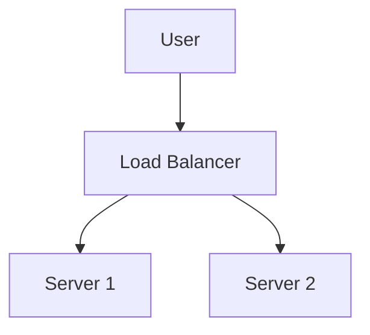

# Markdown Viewer

**Write in Markdown, export to perfect Word with one click.**

*Completely Free · Local Processing · 18+ Professional Themes · 8 Languages Support*

---

You love writing in Markdown — clean, efficient, version control friendly.  
But eventually, you always need a Word document.

**The old nightmare:**

😫 Manual screenshot flowcharts · Copy-paste formulas become messy · Format code by hand · Adjust tables cell by cell · Spend another 30 minutes tweaking fonts, spacing, and colors after export

**One document: 1 hour writing, 2 hours formatting.**

---

**Now it takes just 1 second.**

Click to download and get a perfect Word document:
- ✅ Mermaid diagrams → High-resolution images
- ✅ LaTeX formulas → Word editable equations
- ✅ Auto syntax highlighting (100+ languages)
- ✅ 18+ professional themes with one click
- ✅ Completely free, local processing

**Spend time on writing, not on formatting.**

---

## 💫 See It in Action

### Technical Documentation: 15 Flowcharts, 2 Hours → 5 Minutes

**Before:** draw.io diagram → Export PNG → Insert into Word → Resize → Repeat 15 times = **2 hours**

**Now:** Write Mermaid code → Click download = **5 minutes**

## System Architecture

``````markdown

``````

Need changes? Modify code and re-export. **Save 115 minutes.**

### Academic Paper: 50+ Formulas, 3 Hours → 10 Minutes

**Before:** Word equation editor one by one OR paid tool subscription = **3 hours + Paid subscription**

**Now:** Write LaTeX syntax directly → Click download = **10 minutes + Free**

Given mass $m$ and acceleration $a$, according to Newton's second law:

```markdown
$$
F = ma = m\frac{dv}{dt} = m\frac{d^2x}{dt^2}
$$
```

Export as native Word format, fully editable. **Not an image, but a real equation object.**

### Team Collaboration: Weekly Reports, 1 Hour → 1 Minute

**Before:** Copy content → Set format → Adjust lists → Add styling → Screenshots = **1 hour weekly**

**Now:** Open file → Choose theme → Click download = **1 minute**

Choose "Business" theme for professional look. **Save 59 minutes weekly.**

---

## 🎯 Three Core Features

### 1. Automatic Diagram Conversion

All Mermaid types · SVG images · Complex HTML tables

**Time comparison:** Complex sequence diagram (10 objects)
- Traditional tools: Draw 30min + Modify 20min + Adjust 10min + Export 5min = **65 minutes**
- Markdown Viewer: Write code 5min + Modify 30sec + Export 1sec = **6 minutes**

**Save 59 minutes — time for two coffee breaks.**

### 2. Perfect Formula Conversion

LaTeX → Word editable equations (not images!)

After export, you can:
- ✅ Continue editing in Word
- ✅ Adjust font size
- ✅ Modify symbols and variables
- ✅ Copy to other documents

**One formula, two approaches:**
- ❌ Word equation editor: Click...click...click...select symbols...adjust positions
- ✅ LaTeX: `\int_0^\infty e^{-x^2}dx` Done

### 3. 18+ Professional Themes

Different scenarios, different styles, one-click switch:

- 📊 Business / Technical → Business reports, technical docs
- 📚 Academic / Palatino → Academic papers, book typesetting  
- 🇨🇳 Songti / Heiti / Mixed → Chinese documents
- 🎨 Typewriter / Sakura → Creative content

**WYSIWYG:** Preview looks exactly like exported Word. No guessing, no trial.

**No more manual adjustments:** Font, size, line spacing, paragraph spacing, code background...

---

## ⚡ Lightning Fast Experience

### Smart Cache: First Time 5s, Second Time 1s

Document with 50 Mermaid diagrams:
- **First open:** Text displays instantly, diagrams render in background, all done within 5s
- **Second open:** Load from cache, instant display (<1s)
- **Text modified:** Still instant (diagrams from cache)
- **Diagram modified:** Only re-render changed diagrams

**10x faster than Word, 100x smaller files.**

### Reading Enhancement

- **Three layouts:** Normal (1000px) / Full screen / Narrow (530px, preview Word effect)
- **Flexible zoom:** 50%-400%, shortcuts `Ctrl/Cmd +` `-` `0`
- **Smart TOC:** Auto-extract headings, sidebar navigation, `Ctrl/Cmd + B` to toggle
- **Position memory:** Auto-save scroll position, continue reading next time
- **History:** Track recently opened documents

---

## 🚀 Quick Start - 3 Steps

### Step 1: Install Extension (30 seconds)

1. Open Chrome browser
2. Visit Chrome Web Store
3. Search "Markdown Viewer"
4. Click "Add to Chrome"
5. ✅ Installation complete

### Step 2: Allow File Access (1 minute)

**If you want to open local .md files:**

1. Open `chrome://extensions/`
2. Find Markdown Viewer
3. Enable "Allow access to file URLs"
4. ✅ Now you can double-click to open local Markdown files

**Not needed if:**
- Only viewing online docs (GitHub, blogs, etc.)
- Using browser's "Open File" function

### Quick Start

**Open documents:** Double-click .md files, or drag to browser · GitHub docs auto-rendered

**Export to Word:** Click download button or `Ctrl/Cmd + S` → See progress → Auto-save

**Switch themes:** Click toolbar → Choose theme → Apply instantly

**Adjust view:** `+`/`-` zoom · Layout switch · `Ctrl/Cmd + B` TOC

---

## 🎁 Complete Features

### Full Markdown Syntax Support

Headings · Paragraphs · Bold · Italic · Strikethrough · Lists · Task lists · Blockquotes · Code blocks (100+ languages highlighted) · Tables · Links · Images · Mermaid diagrams · LaTeX formulas · HTML · GFM extensions

### 18 Themes

**Business:** Default · Business · Technical  
**Academic:** Academic  
**Serif:** Palatino · Garamond · Cambria · Elegant  
**Sans-serif:** Verdana · Trebuchet · Century  
**Chinese:** Songti · Heiti · Mixed  
**Creative:** Typewriter · Sakura · Water · Minimal

### 8 Interface Languages

Simplified Chinese · English · Deutsch · Español · Français · 日本語 · 한국어 · Русский

---

## 💎 Competitive Advantages

|  | Manual Screenshots | CLI Tools | Online Services | Desktop Editors | Markdown Viewer |
|---|:---:|:---:|:---:|:---:|:---:|
| **Ease of Use** | Tedious | Setup needed | Upload needed | Install needed | ✅ One-click |
| **Mermaid** | Manual screenshot | Plugin needed | ✅ Supported | ✅ Supported | ✅ Native support |
| **Math Formulas** | Images | Images | Images | Images | ✅ Editable |
| **Privacy** | ✅ Local | ✅ Local | ❌ Cloud upload | ✅ Local | ✅ Local |
| **Themes** | - | - | 3-5 | 5-10 | ✅ 18+ |
| **Offline** | ✅ | ✅ | ❌ | ✅ | ✅ |
| **GitHub Direct View** | ❌ | ❌ | ❌ | ❌ | ✅ |
| **Price** | Free | Free | Paid plans | Paid plans | ✅ Free |

**Core advantage: Faster, cheaper, safer, more powerful.**

---

## ❓ FAQ

**Q: Can I edit the exported Word document?**  
A: Yes. Standard .docx format, math formulas are editable, not images.

**Q: Which diagrams are supported?**  
A: All Mermaid diagrams (flowchart, sequence, gantt, class, state, pie, ER, etc.) + SVG auto-conversion.

**Q: Is there a file size limit?**  
A: No limit. Smart cache, documents with 100+ diagrams open instantly.

**Q: Does it require internet?**  
A: No. Completely local processing, works offline.

**Q: Will my documents be uploaded?**  
A: Never. All processing happens locally.

**Q: How to switch themes?**  
A: Click toolbar icon → Select theme → Apply instantly.

**Q: Can I customize themes?**  
A: Currently 18 preset themes, customization coming soon.

**Q: Will large documents lag?**  
A: No. Progressive loading + smart cache, text displays instantly, diagrams render in background (first 5s, second 1s).

**Q: Does cache take up much space?**  
A: Default max 1000 items, approximately 500 MB, adjustable or clearable in settings.

**Q: Which browsers are supported?**  
A: Chrome and Chromium-based browsers (Edge, Brave, Opera).

**Q: Which Word versions can open the exported file?**  
A: Word 2016+ fully supported, Word 2013 also works. Fully compatible with WPS Office.

**Q: Can I export to PDF?**  
A: Currently Word only, PDF planned. You can export to Word then save as PDF.

**Q: Which theme suits me?**  
A: Business reports → Business · Academic papers → Academic · Technical docs → Technical · Chinese docs → Songti/Mixed

---

## 🔒 Privacy Commitment

- ✅ All processing done locally, never uploaded
- ✅ No tracking, no personal data collection
- ✅ Open source code, auditable and transparent
- ✅ Chrome Web Store security approved (Manifest V3)

**Your privacy is 100% protected.**

---

## 🆘 Get Help

📖 [Full Documentation](https://github.com/xicilion/markdown-viewer-extension) · 🐛 [Report Issues](https://github.com/xicilion/markdown-viewer-extension/issues) · 💡 [Feature Requests](https://github.com/xicilion/markdown-viewer-extension/issues) · ⭐ [GitHub Star](https://github.com/xicilion/markdown-viewer-extension)

---

## 🎉 Get Started Now

**Install in 30 seconds, start using immediately:**

1. Visit Chrome Web Store → Search "Markdown Viewer"
2. Click "Add to Chrome"
3. Drag `.md` files to browser
4. ✅ Start using

**You'll get:** Markdown → Word one-click conversion · Mermaid auto-convert · LaTeX editable formulas · 100+ languages syntax highlighting · 18+ themes · Smart cache · Completely free

**Perfect for:** Technical writers · Students/researchers · Product managers · Developers · Anyone using Markdown

---

## 📜 Open Source License

This project is open source under ISC license. Welcome to Star, report issues, suggest features, and contribute code.

**Project URL:** https://github.com/xicilion/markdown-viewer-extension

---

**Stop wasting time on formatting**

**Focus on writing, let Markdown Viewer handle everything else**

### [🚀 Install Now](https://chrome.google.com/webstore)

*Completely Free · Local Processing · Privacy Protected*
